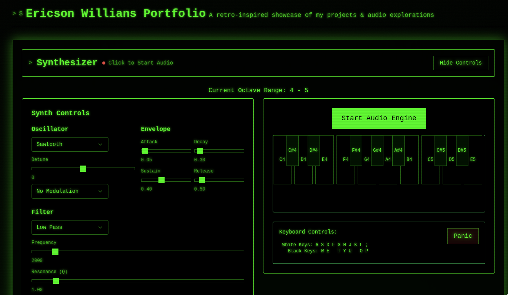

# Ericson Willians Portfolio

A sophisticated web application showcasing advanced React architecture and real-time audio synthesis capabilities, presented through an elegantly crafted retro-terminal interface. This project demonstrates professional-grade web development practices, combining React, TypeScript, and Web Audio APIs within a carefully designed terminal-inspired user interface.



## Technical Overview

This portfolio application exemplifies the seamless integration of modern web technologies while maintaining exceptional performance and code quality standards. The architecture leverages Vite's advanced bundling capabilities, React's component model, and TypeScript's type safety to deliver a robust and maintainable codebase.

### Core Technologies

- **Framework**: React 19 with TypeScript
- **Build System**: Vite
- **Package Management**: pnpm
- **Styling**: Tailwind CSS with custom configuration
- **UI Components**: shadcn/ui and Radix primitives
- **Audio Processing**: Tone.js
- **State Management**: React Context and Custom Hooks

### Key Features

The application implements several advanced features:

**Advanced Audio Synthesis Engine**
- Professional-grade polyphonic synthesizer with voice management
- Real-time audio processing using Web Audio API via Tone.js
- Multiple synthesis modes including Subtractive, FM, and AM
- Comprehensive effect chain with reverb, delay, and distortion
- Advanced modulation capabilities with LFO routing
- Dynamic parameter automation with smooth transitions

**Professional UI Implementation**
- Terminal-inspired interface with modern design principles
- Responsive keyboard layout with dynamic sizing
- Real-time visual feedback for audio parameters
- Accessibility-focused component architecture
- Custom UI components built on shadcn/ui primitives

**Technical Architecture**
- Modular component structure
- Type-safe development environment
- Advanced state management
- Efficient audio engine implementation
- Comprehensive error handling

## Project Structure

```
src/
├── components/
│   ├── layout/       # Core layout components
│   ├── sections/     # Main content sections
│   ├── synth/        # Synthesizer components
│   └── ui/           # Reusable UI components
├── hooks/            # Custom React hooks
├── providers/        # Context providers
├── types/           # TypeScript definitions
└── constants/       # Application constants
```

## Development

### Prerequisites

- Node.js (v18 or higher)
- pnpm (v8 or higher)
- Modern web browser with Web Audio API support

### Installation

```bash
# Clone the repository
git clone https://github.com/ericsonwillians/ericson-willians-portfolio.git

# Navigate to project directory
cd ericson-willians-portfolio

# Install dependencies
pnpm install

# Start development server
pnpm dev
```

### Building for Production

```bash
# Create production build
pnpm build

# Preview production build
pnpm preview
```

## Technical Implementation Details

### Synthesizer Architecture

The synthesizer implementation features a sophisticated voice management system:

- Polyphonic engine with up to 16 voices
- Dynamic voice allocation with voice stealing
- Professional-grade audio processing chain
- Comprehensive parameter automation
- Advanced modulation routing system

### State Management

The application employs a robust state management approach:

- Custom hooks for audio engine interaction
- Context providers for global state
- Efficient component memoization
- Type-safe state updates
- Real-time parameter synchronization

### Performance Optimization

Several optimization techniques are implemented:

- Efficient voice allocation algorithm
- Smooth parameter transitions
- Optimized render cycles using React.memo
- Dynamic component loading
- Careful memory management

## Deployment

The application is configured for deployment to GitHub Pages using GitHub Actions:

```bash
# Deploy to GitHub Pages
pnpm deploy
```

## License

This project is licensed under the MIT License. See the [LICENSE](LICENSE) file for details.

## Author

Ericson Willians <<ericsonwillians@protonmail.com>>

## Acknowledgments

This project leverages several open-source technologies:

- Tone.js for professional audio synthesis
- shadcn/ui for accessible component primitives
- Tailwind CSS for utility-first styling
- Vite for advanced build tooling
- React for component architecture